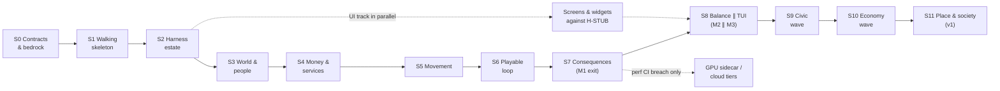
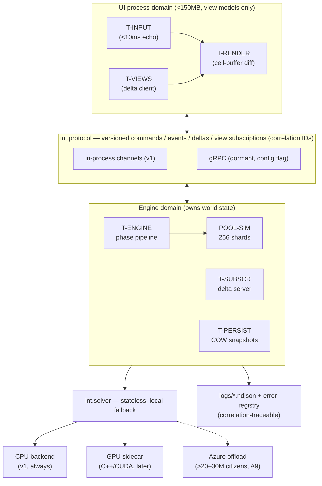

# Metropolis Sprint Plan v1.0

**2026-08-08 · derived from `docs/METROPOLIS-MASTER-v2.1.md` + `docs/planning/master-plan-v2.1.json` (v1.1.0) · sprint numbers are loaded into the metro BOW (`node claude-bow.js ready` / `list --by-seq`)**

Status of this document: build order and engineering doctrine are **enacted** (BOW carries them); the Golden Rule changes in §7 are **proposals for Aaron** — rules only change with his sign-off.

---

## 1. The optimisation doctrine — why this order produces the fewest defects

Six principles drive every sequencing decision below. Each attacks a specific defect class:

1. **Contracts before code.** Most defects in a two-domain system (UI ⇄ engine) are born at the boundary. The protocol, serializer and solver contracts are designed, reviewed and **frozen v1** before anything consumes them (Sprint 0). After freezing, changes are versioned — never silent. The interface GUIDs in `code.json` are the audit trail.
2. **Rigs before logic.** The determinism gate, invariant checker, perf CI and UI snapshot harness all exist **before** the models they will catch defects in. A test rig built after the code inherits the code's assumptions; built first, it defines them. This is the master doc's own TDD order (A8), generalised.
3. **Stub-driven UI — the decoupling is structural, not aspirational.** The UI is built complete against H-STUB and never holds world state, only view models built from protocol deltas (§4 below). The engine can move out-of-process, onto the GPU sidecar, or into Azure by config flag because the UI *cannot tell the difference* — it was literally developed against a fake.
4. **Vertical walking skeleton first.** End-to-end integration risk (protocol plumbing, registry boot, delta application, render loop) is retired in Sprint 1 on a system that computes nothing. Integration defects found in month 1 cost hours; found in month 12 they cost the architecture.
5. **Riskiest models earliest, with the meters already running.** The two hardest engineering problems — the 100M-citizen store (scale risk) and traffic equilibrium (algorithmic risk) — start in Sprints 3 and 5, *after* H-SYNTH perf CI exists (Sprint 2), so every commit graphs tick-cost against synthetic 1M/10M cities from the first line of model code. Performance is a test, not a hope (M0-ENG §6.5).
6. **One module real at a time, stubs forever.** Every engine module registers behind an interface with a maintained stub (M0-ENG §2). The engine always boots with any real/stub mix; a defect in the new module is isolated by flipping it to stub in F12. Conformance is testable: the same command log against stub and real must produce schema-identical delta shapes (the API-harness contract test, run in CI from Sprint 2).

**Direct answer to "do we build the money and tax system first?"** — No. First come contracts and rigs (defects at boundaries and untested cores are the expensive ones), then the walking skeleton, then world+citizens (the scale risk). **Money arrives in Sprint 4** as the first cross-cutting real model — early, because every later system touches the ledger and the money-conservation invariant then guards *all* of them — but the **full §39 tax instrument panel waits until Sprint 9**: it needs districts, elasticity display and incidence machinery, and only headline rates are required to close the M1 loop. Building the full tax panel first would mean building it against systems that don't exist yet, then rebuilding it — the classic source of rework defects.

## 2. Sprint sequence

Sprints are scope-boxed, not time-boxed — each has a testable exit gate, and the gate, not a calendar, opens the next sprint. Items are BOW mkeys; `node claude-bow.js show <mkey>` gives full detail.

| # | Name | Items | Exit gate (all testable) |
|---|------|-------|--------------------------|
| **S0** | **Contracts & bedrock** (M0) | int.protocol, int.serializer, int.solver, foundation.errors, foundation.repo, foundation.det, foundation.registry, foundation.data, tool.bow, tool.planguard, tool.ready ✅, feat.georef | Protocol/serializer/solver schemas reviewed by Aaron and frozen v1; CI green incl. lint + escape-analysis gates; error registry + correlation logging operational; plan-drift guard hook live |
| **S1** | **Walking skeleton** | harness.stub, engine.core, feat.detgate, harness.headless, ui.core, ui.widgets, ui.screen.map, feat.skeleton, ui.screen.debug, feat.debugmode | Skeleton runs end-to-end on Folkestone-64; determinism gate green at 1 and 14 workers; F12 shows every module as stub with health OK |
| **S2** | **Harness estate** | harness.replay, ui.harness, harness.synth, ui.keys, engine.invariant, data.catalogue | UI latency budgets asserted in CI; stub-vs-real conformance suite runs; perf CI graphs tick-time vs 1M/10M synthetic; key grammar reaches everything the mouse can |
| **S3** | **World & people** (scale risk) | engine.world, engine.citizens, engine.season | Real OS Terrain 50 tile imports; 10M synthetic citizens advance a month inside budget on reference hardware; camera-invariance (A7) and shard-count invariance tests green |
| **S4** | **Money & services frame** | engine.market, engine.finance, engine.consumption, engine.unlocks, engine.services | Money conservation invariant green over 120 headless months; closed loop wages→spend→tax→budget→opex; utility networks solve; milestone tiers 1–4 gate correctly |
| **S5** | **Movement** (algorithmic risk) | engine.traffic, engine.roads | SUE converges in fixed iterations on warm starts, bit-identical across worker counts; junction spillback fixture demonstrates upstream blocking; commute times populate citizen records |
| **S6** | **The playable loop** | engine.logistics, engine.build, engine.households, engine.attract | Headless city grows from 0: zone→build→migrate→work→deliver; JIT shortfalls propagate to satisfaction/production; junction queue renders; attractiveness moves migration both directions |
| **S7** | **Consequences** (M1 exit) | engine.projections, engine.wellbeing, engine.spiral, engine.extcommute, feat.saveux | 300 game-years headless in seconds–minutes; Detroit spiral reproducible from a scripted shock scenario; saves round-trip bit-identical; Slow-Fuse projections render for education/debt-class decisions |
| **S8** | **Balance ∥ TUI** (M2 ∥ M3) | balance.harness ∥ ui.diagrams, ui.dash, ui.alerts, ui.screen.finance/build/services/trade/demo/proj/ticker/menu, engine.news | Sweeps tuning pacing/growth run unattended; all F-screens live on the real engine; the drill-through rule holds on every number; alerts jump to source |
| **S9** | **Civic wave** (M4) | engine.education, engine.dispatch, engine.refuse, engine.social, engine.tax, engine.fiscal, engine.policies, ui.screen.districts | Full tax panel with elasticity + incidence; policies preview impact before enactment; education fuse + dispatch outcome curves live; conservation invariants extended to each new stock |
| **S10** | **Economy wave** (M4) | engine.firms, engine.freight, engine.comms, engine.shopping, engine.parking, engine.capexport, engine.fdi, engine.rail, engine.fuel | Firms found/grow/fail from real citizens; chains conserve tonnes; capacity-export contracts cross internal demand in F7; balance-of-trade flips demo |
| **S11** | **Place & society wave** (M4 exit = v1) | engine.crime, engine.prison, engine.farming, engine.mining, engine.cafe, engine.leisure, engine.tourism, engine.coastal, engine.destination, engine.chemicals, engine.tunnels, engine.defence, feat.disasters | Full v1 surface; gang formation/removal cycle testable; blight viewshed uses real elevation; August tourism stress scenario passes; win/loss endings reachable in balance runs |
| — | **Unscheduled (future)** | cloud.gpu, cloud.azure, future.slots | Triggered by perf CI breaching budgets (§6 below), never speculatively |

Within a sprint, work **strictly from `node claude-bow.js ready`** — priority, then seq. The two-track shape from S2 onward is deliberate: UI items depend only on contracts + H-STUB, never on engine internals, so UI and engine tracks proceed in parallel without merge conflicts by construction.

## 3. What Sprint 0 actually produces (the anti-defect investment)

Nothing user-visible — and it is the highest-leverage sprint in the plan:

- **Frozen contracts** (`int.protocol`, `int.serializer`, `int.solver`): reviewed message schemas with correlation IDs on every command. Every later module writes to a stable target.
- **`foundation.errors`**: registry-sourced error codes (`data/errors.json`, `MET-<layer><NNN>`), correlation propagated command→phase→delta→log, NDJSON logs stored and reviewable (F12 tail + `metctl errors`). GR#1/GR#7 become *mechanical* — an unregistered error code fails lint, not review.
- **`foundation.det`**: the 256-shard scheduler and counter-RNG that make "same seed ⇒ same city" a property, not a hope.
- **CI with teeth**: escape-analysis gate, gctrace perf gate, custom lint (map-range ban, RNG discipline), plan-drift guard. Defects that CI catches mechanically never reach review; defects review must catch sometimes ship.

## 4. The UI decoupling guarantee (your cloud requirement)

Enforced four ways, all already in the plan:

1. **Protocol-only contact.** The UI process domain holds *view models built from deltas* — never world state (UI-SPEC §1; memory cap <150 MB asserted). No import path from `internal/ui/*` to `internal/engine/*` — enforced by a lint rule (proposed GR#20 below).
2. **Built against a fake.** Every screen is developed and regression-tested against H-STUB and recorded fixtures. If a screen secretly needed engine internals, it could not have been built.
3. **View subscriptions are the remote seam.** The engine pushes deltas only for live subscriptions (UI-SPEC §6) — precisely the shape a networked client needs. Flipping in-process channels to gRPC is a config change because both sides already speak only the versioned protocol.
4. **Heavy lift behind the solver contract.** Traffic assignment, cold-pass batches, deep projections and batch life-writing call `int.solver` — a stateless request/response interface with mandatory local fallback. CPU v1 → GPU sidecar → Azure are three backends of one seam (A9 thresholds are explicit: local to ~20–30M citizens). The engine cannot tell which answered except by latency.

## 5. API harness testing — the contract-test estate

- **Stub-vs-real conformance** (from S2): identical command logs against `Stub` and real implementations must yield schema-identical delta shapes and identical event vocabularies. New module ⇒ new conformance fixtures, or the module doesn't merge (Definition of Done, M0-ENG §6.3).
- **Golden fixtures** (H-REPLAY): recorded command/delta streams are the regression corpus for *both* sides — UI renders them (snapshot asserts), engine replays them (state-hash asserts).
- **Chaos knobs** (H-STUB): delayed/burst/out-of-order deltas prove UI budgets under stress before a real engine ever misbehaves.
- **Determinism gate + shard-invariance**: every merge, 120 months twice, and 1-vs-14 workers, hash-compared. Written first (S1), on the stub.

## 6. Go vs C# — adjudication

Constitution says Go (I.3). Re-examined honestly against this specific design:

| Criterion | Go | C# (.NET 8+) | Weight for Metropolis |
|---|---|---|---|
| Terminal cell-level UI | **tcell** — mature, low-level, Windows Terminal + conhost solid; exactly the retained-buffer substrate UI-SPEC §1 assumes | Terminal.Gui is forms-oriented; Spectre.Console is not a retained-buffer game surface; you'd write the console layer largely from scratch against Win32 APIs | **High — decisive for a TUI-first game** |
| Deterministic parallel simulation | Simple runtime, one compiler; goroutines + channels map 1:1 onto T-INPUT/T-RENDER/POOL-SIM topology; discipline lint-enforceable with golangci-lint | Achievable (fixed-point money, ordered reductions) but a larger runtime surface to audit; Roslyn analyzers equally strong | Medium — both workable, Go simpler to *prove* |
| GC / memory control at 20 GB | No compaction, low-pause concurrent GC; arenas-as-slices + `GOGC` tuning + **mmap'd cold shards outside the heap entirely** (the A1 SoA store is file-backed, invisible to GC) | Excellent server GC, real structs, `Span<T>`; arguably finer control in-heap | Medium — different tools, same outcome; the design keeps the big data off-heap either way |
| SIMD / vector math (cold pass, SUE inner loops) | Weak intrinsics story (assembly or careful auto-vectorisable loops) | **Genuinely better**: `Vector<T>`, hardware intrinsics | Medium — **this is C#'s real advantage**, but the architecture already routes vector-heavy work behind `int.solver`, where a native/CUDA sidecar outruns both languages |
| Single-binary deploy, startup | Trivial, tiny, instant | NativeAOT is good now, but trims/reflection caveats | Low-medium — Go cleaner |
| gRPC / protocol | First-class | First-class | Neutral |
| CUDA sidecar | Separate C++ process either way | Same | Neutral |
| Build/test loop speed for an AI builder | Very fast compiles, one formatter, mechanical style — fewer review cycles | Slower builds, more idiom variance | Medium — matters for Claude Code throughput |

**Verdict: stay with Go.** The two decisive factors are the TUI substrate (tcell has no C# equivalent at this level, and the UI is half the product) and the simplicity of *proving* determinism and enforcing discipline mechanically. C#'s honest advantage — SIMD throughput in batch numeric loops — is exactly the work the constitution already exiles behind the solver seam, where the endgame answer is the GPU sidecar, not managed vector code. Switching would also re-open a frozen constitution entry and invalidate zero-cost, already-committed planning for a marginal gain in the one place we've architected the escape hatch.

**Guard-rail (recorded):** if S3 perf CI shows the pure-Go cold pass or S5 shows SUE breaching budget by >2× on the 10M synthetic, the response is to *pull the GPU sidecar forward* (cloud.gpu, currently unscheduled) — not to port the engine.

## 7. Hooks, skills and rules — adjustments

**Enacted this session (tooling, no rule changes):**

| Change | What |
|---|---|
| BOW `sprint` field + `ready` command | Build order and ready-to-build view are first-class (`list --by-seq`, `ready`) |
| `/sprint` skill (new) | Sprint board: current sprint, ready items, blockers; "work only from ready" |
| `/bow` skill updated | v2 fields, `import`, `ready`, master-plan vs ad-hoc item rules |

**Queued as Sprint 0 BOW items:**

| Item | What |
|---|---|
| `tool.planguard` | PreToolUse commit hook: `generate.js --check` + drift diff — hand-edited `code.json` or stale regeneration blocks the commit |
| `tool.bow` (repurposed per decision) | Commit-msg validation that `[mkey]` refs exist in the BOW + auto-`ref` of commit hashes onto items |
| `legacy.versionguard` (FEAT-002) | Guard retarget: when `cmd/`/`internal/` exist, drop the two-file version check (version = git describe via ldflags) and enforce BOW refs on engine/UI/data commits instead |

**Proposed for Aaron (Golden Rules are yours — nothing changed until you approve):**

1. **GR#2 amendment (Metropolis profile):** "bump on every commit" becomes, for the Go app: *version is `git describe --tags` injected at build; milestone cuts are annotated tags `v0.<milestone>.<n>`; the guard enforces a BOW ref on every engine/UI/data commit instead of a file bump.* Root tooling stays exempt as today. Rationale: M0-ENG §3 explicitly bans hand-maintained version files; GR#2's *intent* (traceable versions, verified after push) is kept via tags + CI.
2. **New GR#20 — Contract-first, stub-forever:** no module consumes another except through its registered interface; every module keeps a passing stub for the life of the project; interface changes require a version bump on the interface GUID entry in `code.json`. (Elevates M0-ENG §2/§6.3 from working agreement to inviolable rule; the `internal/ui → internal/engine` import ban is lint-enforced under this rule.)
3. **New GR#21 — A red determinism gate stops the line:** any determinism CI failure is automatically P0 (the BOW schema's spirit: `determinism ⇒ always P0`); nothing else merges until it is green. Rationale: determinism debt is unpayable later — a single nondeterministic merge poisons every fixture recorded after it.
4. **Skills housekeeping:** retire the 13 Prix-Six/Firebase skills (`/deploy`, `/fs`, `/rules-deploy`, `/iam-check`, `/new-secret`, `/new-collection`, `/cc`, `/check-race-data`, `/openf1`, `/fn-status`, `/bot-status`, `/feedback`, `/triage-errors`) once the Go stack lands; retarget `/codejson-audit` + `/sync-codejson` + `/register-guid` to the generated-code.json world (audit = `generate.js --check` + verifying built code carries its module GUID header per GR#6); adapt `/health-check` to check determinism gate + perf CI + BOW ready-queue health.

## 8. Decision log (this session)

| Decision | Outcome |
|---|---|
| MOD-001 legacy app skeleton | **Cancelled** — Go monorepo per M0-ENG §5; version via ldflags (recommendation (a) accepted) |
| MOD-007 in-repo `metropolis_bow` | **Not built** — the metro BOW is the project BOW (now carries all spec fields); item repurposed to BOW⇄git integration |
| FEAT-002 version guard | Retargeted (see §7 table); P1, Sprint 0 |
| Language | **Go confirmed** (§6), with the sidecar-first guard-rail recorded |
| Sprint structure | S0–S11 enacted in BOW; cloud items unscheduled behind perf triggers |
